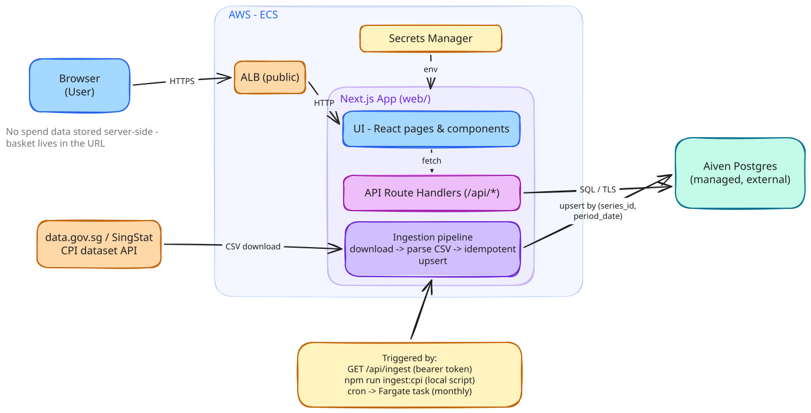

# Personal Inflation Calculator (SG)

Answers one question: **"How much have prices risen for someone who spends like me?"**

The official Consumer Price Index (CPI) tracks price changes for an *average* household's basket
of goods, but no one spends exactly like the average household. This app takes a user's monthly
spending by category, computes their personal inflation rate using official Singapore CPI data
from data.gov.sg / SingStat, and compares it against the headline rate.

## How it works

1. User enters (or adjusts a preset for) monthly spending across CPI categories such as Food,
   Housing & Utilities, and Transport.
2. The backend computes a weighted personal inflation rate from official category-level CPI
   changes over the selected period:
   ```
   personal_inflation = Σ ( w_i × r_i )
     w_i = user's share of total spending in category i (normalised to sum to 1)
     r_i = % change in category i's CPI over the selected period
   ```
3. Results show the personal rate vs. the official rate, plus which categories drove the
   difference.

CPI data is ingested from data.gov.sg on a schedule and stored in Postgres; the app never proxies
live API calls per request, and **user spending is never stored server-side** — a basket is
shared by encoding it into the URL, not by saving it to a database.

## Architecture

One Next.js app (`web/`) serves both the React UI and the API — the Route Handlers under
`web/app/api/*` *are* the calculation engine's API surface, so there's no separate backend to
deploy or proxy to. It reads and writes an external, already-provisioned **Aiven Postgres**
instance (long-format CPI series/observations, basket presets, ingestion run log). CPI data is
pulled from data.gov.sg on a schedule — via an AWS EventBridge cron rule that runs a one-off
Fargate task in production, or manually via a bearer-token-protected route / local script — and
upserted idempotently, so the app itself never calls data.gov.sg on the request path. In
production the app runs on ECS Fargate behind an Application Load Balancer, provisioned with AWS
CDK (`infra/`).



See [docs/technical-documentation.md](docs/technical-documentation.md) for the full write-up
(data model, calculation engine internals, API reference, ingestion pipeline, infra, testing)

## Repository layout

```
web/            Next.js app — UI + API Route Handlers (the only deployable service)
  app/          Routing: pages, layouts, Route Handlers (app/api/*)
  lib/          Calculation engine, DB access, ingestion, presets, insights — by domain
  components/   UI shared across routes
  migrations/   node-pg-migrate SQL migrations
  scripts/      CLI entry points (migrate, ingest, db check) reused by CDK's scheduled task
infra/          AWS CDK app — network, app (ECS Fargate + ALB), ingestion (scheduled task) stacks
docs/           Technical documentation + the original design brief
```

## Getting started

Prerequisites:
- Node.js 24+
- An Aiven Postgres instance (or any reachable Postgres — the app just needs a connection string)

```sh
cd web
npm install

# Copy the env template and fill in your Postgres connection string
cp .env.example .env.local
```

Fill in `.env.local`:
- `DATABASE_URL` — your Postgres service URI (Aiven console → your service → Connection information)
- `DATA_GOV_SG_API_KEY` — optional, raises data.gov.sg rate limits
- `INGEST_SECRET` — a random string (e.g. `openssl rand -hex 32`) to protect `GET /api/ingest`

Then:

```sh
npm run migrate:up     # create the schema
npm run ingest:cpi     # pull CPI data from data.gov.sg once, so there's data to calculate against
npm run dev            # start the app at http://localhost:3000
```

Visit `/api-docs` for the live Swagger UI (generated from the same Zod schemas that validate
requests at runtime).

Other useful commands (all run from `web/`):

```sh
npm test          # Vitest — unit tests, including validation against SingStat's published CPI
npm run lint       # ESLint
npm run build      # production build
```

## Deployment

`infra/` is a self-contained AWS CDK app with three stacks — a VPC, an ECS Fargate service behind
an ALB running the Next.js app, and a scheduled Fargate task that runs CPI ingestion monthly via
EventBridge. Postgres itself is not provisioned here; the app connects to the existing Aiven
instance via a Secrets Manager secret. See [infra/README.md](infra/README.md) for the full deploy
walkthrough (`cdk bootstrap`, `cdk deploy --all`, populating secrets post-deploy).
